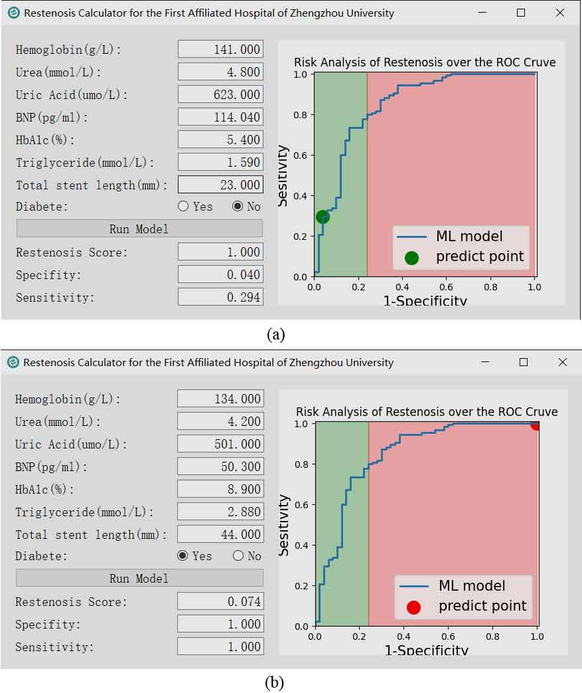

# Value of machine learning approach for predicting in-stent restenosis in coronary artery disease patients implanted with drug-eluting stents

we developed a calculator software based on ML model to predict ISR risk stratification, which only used the best combination of 8 features selected in the ML model. According to the predict score of this calculator, patients would be stratified in low or high risk of arising ISR at the cutoff operating point.

   

**Picture:**  *Overview of the proposed Plug-and-Play (PnP) adaption framework for generalizing gaze estimation to a new domain.*

   

**Picture:**  *Overview of the proposed Plug-and-Play (PnP) adaption framework for generalizing gaze estimation to a new domain.*

   

**Picture:**  *Overview of the proposed Plug-and-Play (PnP) adaption framework for generalizing gaze estimation to a new domain.*

   

**Picture:**  *Overview of the proposed Plug-and-Play (PnP) adaption framework for generalizing gaze estimation to a new domain.*

## Contact

If you have any questions, feel free to E-mail me via: `yinpengwei@stu.hit.edu.cn`
